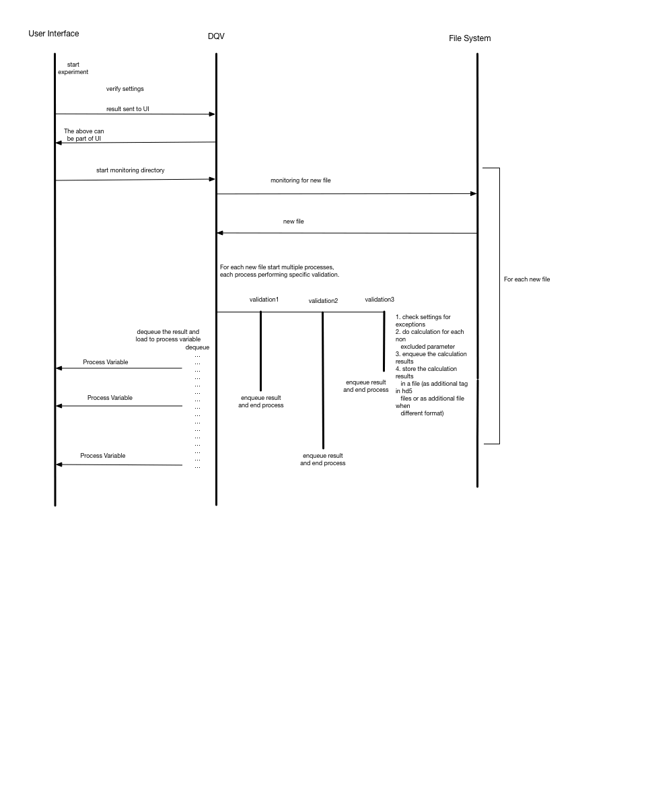

===========
Deliverable 
===========

Prototype the stand alone application Data Quality Verifier (DQV)

DQV tasks include:

- Verify the experiment setup (i.e. all required setup data is entered and the values are acceptable).
- Verify the quality of the data during collection utilizing the set of quantitive QC functions.
- Provide visualization for each slice during data colelction for the qualitative QC.

The DQV will be invoked when the experiment starts and perform these tasks when data is available.

DQV will also verify the quality of the data after all data is collected and processing on the data is completed.

Any calculated quality parameter will be stored. If the data file is in hd5 format, any calculated quality result will be added to the file with a corresponding tag.
If the data file format supports only raw data, the quality parameter results will be stored in a separate file with a name corresponding to the data file.

The experiment user will receive visual feedback on the data quality. 

The DQV will accept exceptions. 

In cases when data is expected to have quality issues (ex. folded image or image taken in motion) the DQV will accept exceptions settings. In the first version the verification will be omitted for the relevant parameters if the exception is applied. In later versions a different quantitive QC functions and limit values can be implemented for specific exceptions.

DQV will provide a set of quantitive QC functions

This part of the project requires research and then implementation of functions that measure quality of the data based on the research.
Links to research resources to investigate:
`CBS_MRI <http://cbs.fas.harvard.edu/usr/mcmains/CBS_MRI_Quality_Control_Workshop.pdf>`_, 
`Neuroimaging <http://cbs.fas.harvard.edu/science/core-facilities/neuroimaging/information-investigators/qc>`_.

DQV will define tables with limit values

The limit values define whether the data is of good or poor quality. The values will be related to the quantitive QC functions.
In the first version the values will be set based on research/tests with the trial data sets. In later versions the limit values can be learned by implementing a learning mechanism.

